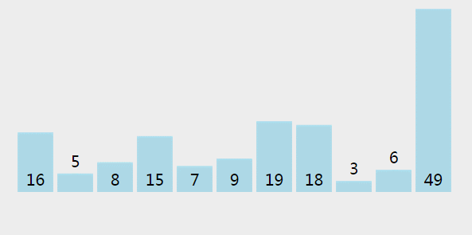

## 选择排序

从数组中第一个元素开始，首先找到数组中最小元素的索引，然后和第一个元素交换值；

然后再在剩余元素中找到最小元素的索引，和数组中第二个元素进行交换值；

重复两个循环，直到排序结束

```javascript
/**
 * 选择排序
 * @param {Array} arr
 */
function sort(arr) {
  let N = arr.length;
  for (let i = 0; i < N; i++) {
    let min = i;
    //找内层循环的最小元素的索引
    for (let j = i + 1; j < N; j++) {
      if (arr[j] < arr[min]) {
        min = j;
      }
    }
    //在外层循环中，和当前数组最前面的元素交换
    let m = arr[i];
    arr[i] = arr[min];
    arr[min] = m;
  }
  return arr;
}
```


## 插入排序

插入排序的原理类似于打扑克，将后面元素中小的元素插入到前面合适的位置

```javascript
/**
 * 插入排序
 * @param {Array} arr
 */
function insertSort(arr) {
  let N = arr.length;
  for (let i = 1; i < N; i++) {
    for (let j = i; j > 0; j--) {
      if (arr[j] < arr[j - 1]) {
        let m = arr[j];
        arr[j] = arr[j - 1];
        arr[j - 1] = m;
      }
    }
  }
  return arr;
}
```


## 冒泡排序

冒泡排序的思想是总是把相邻的两个元素进行比较然后交换位置，这样在一轮循环以后，总能找到最大或者最小的元素放在开头或者结尾，接着按照同样的相邻元素比较，找到下一轮循环最大或者最小的元素。

```javascript
/**
 * 冒泡排序
 * @param {Array} arr
 */
function bubbleSort(arr) {
  let N = arr.length;
  for (let i = 0; i < N - 1; i++) {
    for (j = 0; j < N - 1 - i; j++) {
      if (arr[j] > arr[j + 1]) {
        let m = arr[j];
        arr[j] = arr[j + 1];
        arr[j + 1] = m;
      }
    }
  }
  return arr;
}
```



## 快速排序

快速排序将一个数组按照某个条件（比如不大于某个元素）分成两个子数组，将两部分独立地排序，这样两部分独立地子数组排序完成后整个数组也就排序完成了。

一般来说，快速排序可以通过不断地递归拆分数组来做，对于拆分数组条件的选择，可以直接取数组中间的元素`arr[middleIndex]`，然后循环原数组，对于大于`arr[middleIndex]`的放在一个数组内部，小于`arr[middleIndex]`放在另一个数组内，接着对两个拆分的子数字递归调用拆分函数，直到两个子数组只剩下一个元素为止。

```javascript
/**
 * 快速排序
 * @param {Array} arr
 */
function quickSort(arr) {
  if (Array.isArray(arr) && arr.length <= 1) {
    return arr;
  }
  let leftArr = [];
  let rightArr = [];
  let splitIndex = Math.floor(arr.length / 2);
  let splitElement = arr.splice(splitIndex, 1)[0];
  for (let i = 0; i < arr.length; i++) {
    if (arr[i] < splitElement) {
      leftArr.push(arr[i]);
    } else {
      rightArr.push(arr[i]);
    }
  }
  return [...quickSort(leftArr), splitElement, ...quickSort(rightArr)];
}
```