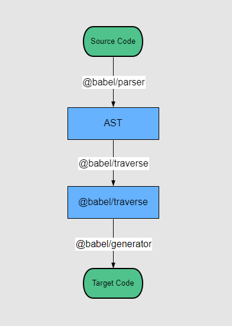
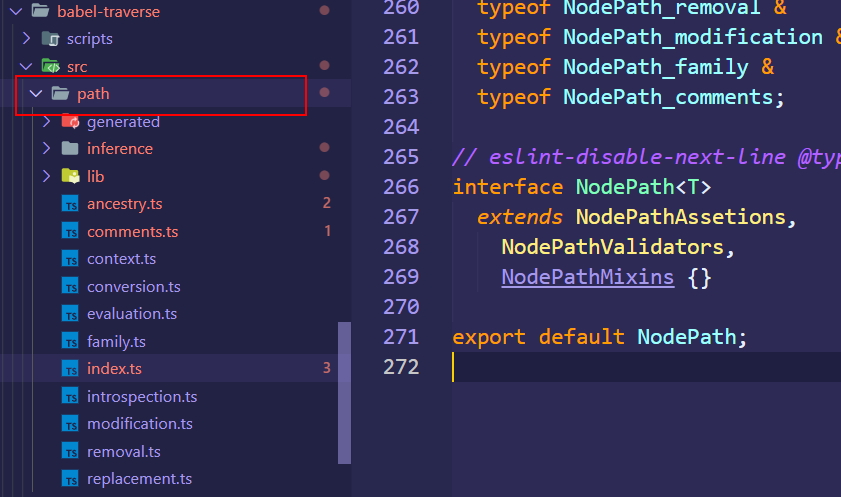

## 概览

`babel`和其它编译程序一样，处理源代码程序同样需要三个步骤：

- `parse`：源代码**解析**成`AST`
- `transform`：**转换**
- `generate`：**生成**目标代码



## @babel/parser

> [@babel/parser](https://babel.dev/docs/en/babel-parser)

`@babel/parser`就是`babel`内部的词法分析器和语法分析器，其基于 [ESTree](https://github.com/estree/estree) 生成`AST`。

`@babel/parser`的使用也很简单，只有两个 API：

- `babelParser.parse(code, [options])`：解析整个代码块字符串
- `babelParser.parseExpression(code, [options])`：解析单句代码

既然`@babel/parser`主要进行词法分析和语法分析，所以其配置项也是和语法约束有，具体见这里 —— [`options`](https://babel.dev/docs/en/babel-parser#options)。

```javascript
const parser = require('@babel/parser');

const result = parser.parse(`
  function square(n) {
    return n * n;
  }
`);
```

例如上面的程序，其得到的`AST`用 JSON 格式可以描述成如下格式：

- `type`标识节点类型，所有类型可以从[这里](https://github.com/babel/babel/blob/master/packages/babel-parser/ast/spec.md)找到
- `name`标识符等的名称
- 此外节点还具有一些属性，用于描述节点在源代码中的位置，例如`start`，`end`，`loc`（location，定位）等。

```json
{
  "type": "Program",
  "start": 0,
  "end": 45,
  "body": [
    {
      "type": "FunctionDeclaration",
      "start": 2,
      "end": 44,
      "id": {
        "type": "Identifier",
        "start": 11,
        "end": 17,
        "name": "square"
      },
      "expression": false,
      "generator": false,
      "async": false,
      "params": [
        {
          "type": "Identifier",
          "start": 18,
          "end": 19,
          "name": "n"
        }
      ],
      "body": {
        "type": "BlockStatement",
        "start": 21,
        "end": 44,
        "body": [
          {
            "type": "ReturnStatement",
            "start": 27,
            "end": 40,
            "argument": {
              "type": "BinaryExpression",
              "start": 34,
              "end": 39,
              "left": {
                "type": "Identifier",
                "start": 34,
                "end": 35,
                "name": "n"
              },
              "operator": "*",
              "right": {
                "type": "Identifier",
                "start": 38,
                "end": 39,
                "name": "n"
              }
            }
          }
        ]
      }
    }
  ],
  "sourceType": "module"
}
```

## @babel/types

> [@babel/types](https://github.com/babel/babel/tree/main/packages/babel-types)

`@babel/types`是用于 AST 节点的 Lodash 式实用程序库，其内部包含创建，验证，转换 AST 节点的方法。`@babel/types`对每种单一类型的节点都有定义，包括节点包含的属性，值，以及如何创建该节点等。

API 太多了，具体见 —— [babel-types#api](https://babel.dev/docs/en/babel-types#api).

```javascript
const parser = require('@babel/parser');
const traverse = require('@babel/traverse');
const t = require('@babel/types');

const ast = parser.parse(`
  function square(n) {
    return n * n;
  }
`);

traverse(ast, {
  enter(path) {
    if (t.isIdentifier(path.node, { name: 'arr' })) {
      path.node.name = 'arr1';
    }
  },
});
```

## @babel/traverse

> [@babel/traverse](https://babel.dev/docs/en/babel-traverse)

`traverse`也就是遍历的意思，`@babel/traverse`负责遍历`AST`树。依托`@babel/types`提供的节点类型以及操作节点的功能，可以做到在仅使用`@babel/traverse`遍历的同时，便可以直接转换，删除和添加节点`AST`对象树的节点。

`plugins`发挥作用的时机就是在 **转换** 的过程中，转换过程也是整个`babel`最繁琐最复杂的过程。

```javascript
const parser = require('@babel/parser');
const traverse = require('@babel/traverse');

const ast = parser.parse(`
  function square(n) {
    return n * n;
  }
`);

traverse(ast, {
  enter(path) {
    if (path.isIdentifier({ name: 'arr' })) {
      path.node.name = 'arr1';
    }
  },
});
```

### visitors

当对`AST`这样的树状结构进行遍历的时候，使用的是**深度优先**的算法。即从根节点开始向内层一层层解析遍历。当我们向下遍历这颗树的每一个分支时我们最终会走到尽头，于是我们需要往上遍历回去从而获取到下一个节点。

这其中涉及到一个`visitors`的概念，即当我们访问一个节点的时候，我们便是`visitors`，每一次访问都有两次机会来访问同一个节点。向下遍历这棵树我们**进入**每个节点，向上遍历回去时我们**退出**每个节点。

例如对于函数解析生成的`AST`，会发生如下过程：

- 进入`FunctionDeclaration`
  - 进入 `Identifier (square)`
  - 走到尽头
  - 退出 `Identifier (square)`
  - 进入 `Identifier (n)`
  - 走到尽头
  - 退出 `Identifier (n)`
  - 进入 `BlockStatement (body)`
  - 进入`ReturnStatement (body)`
    - 进入 `BinaryExpression (argument)`
    - 进入`Identifier (left)`
      - 走到尽头
    - 退出 `Identifier (left)`
    - 进入`Identifier (right)`
      - 走到尽头
    - 退出 `Identifier (right)`
    - 退出 `BinaryExpression (argument)`
  - 退出 `ReturnStatement (body)`
  - 退出 `BlockStatement (body)`
- 退出 `FunctionDeclaration`

从以上遍历过程抽象出来的**`visitors`实际上就是一个对象**，定义了用于在一个树状结构中获取具体节点的方法，其内部具有多种对应[节点类型](https://github.com/babel/babel/blob/master/packages/babel-parser/ast/spec.md)的方法，因此通过`visitor`调用其内部的方法也就是访问节点本身了。

```javascript
const MyVisitor = {
  Identifier: {
    enter() {
      console.log('Entered!');
    },
    exit() {
      console.log('Exited!');
    },
  },
};
```

这是一个简单的访问者，把它用于遍历中时，每当在树中遇见一个 `Identifier`（标识符） 的时候会调用 `Identifier()` 方法，其中进入的时候调用`enter`，退出遍历访问`exit`。

### paths

`AST`有很多节点，节点之间通过`paths`来进行关联，`path`是表示两个节点之间关联关系的可操作和访问的巨大可变对象，当调用一个修改树的方法后，`paths`也会被更新。 Babel 内部会管理这一切，从而使得节点操作简单，尽可能做到无状态。

例如对于源代码函数

```javascript
function square(n) {
  return n * n;
}
```

节点`square`作为函数的名称，其为标识符类型`Identifier`，需要建立和函数类型`FunctionDeclaration`的连接，那么

`path`看起来可以描述以下形式：

```json
{
  "parent": {
    "type": "FunctionDeclaration",
    "id": {...},
    ....
  },
  "node": {
    "type": "Identifier",
    "name": "square"
  }
}
```

### path in visitor

如上所述，`visitor`即一个对象，当其内部具有`Identifier()`方法的时候，实际上是在访问`path`而非节点本身。

```javascript
const MyVisitor = {
  Identifier(path) {
    console.log('Visiting: ' + path.node.name);
  },
};
```

`path`包含了一系列节点原始数据信息

```json
{
  "parent": {...},		// 父节点
  "node": {...},			// 节点本身
  "hub": {...},
  "contexts": [],			// 上下文对象
  "data": {},
  "shouldSkip": false,
  "shouldStop": false,
  "removed": false,
  "state": null,
  "opts": null,
  "skipKeys": null,
  "parentPath": null,
  "context": null,
  "container": null,
  "listKey": null,
  "inList": false,
  "parentKey": null,
  "key": null,
  "scope": null,
  "type": null,
  "typeAnnotation": null
}
```

同时`path`还包含了许多查找节点的方法

```javascript
// 查找父节点
path.findParent;

// 查找当前节点
path.find;
```

具体这些可以从`@babel/traverse`的源码中了解



## @babel/generator

> [@babel/generator](https://github.com/babel/babel/tree/main/packages/babel-generator)

`@babel/generator`负责将`AST`再转换成 JS 代码，同时还会创建 source map。

生成目标代码的过程需要对转换后的`AST`进行深度优先遍历，然后根据节点之间的关系构建并输出最终的代码字符串。

```javascript
const parser = require('@babel/parser');
const generate = require('@babel/generator');

const code = `
  const arr = [1, 2, 3, 4, 5];

  function testCode(arr) {
    return arr.map((v) => v * 2);
  }

  testCode(arr);
`;

const ast = parser.parse(code);
```

