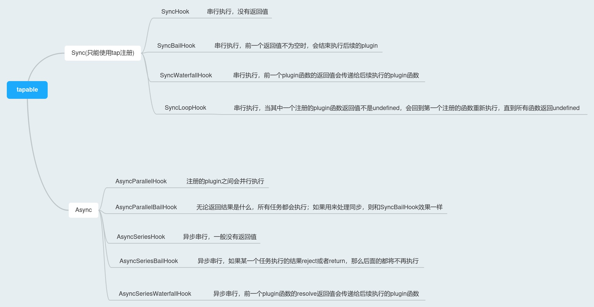

## 什么是 plugin

webpack 的`plugin`是一个`class`，其实例化以后，对象内部具有一个`apply`方法，作为调用的入口。

`plugin`主要用于拓展`webpack`能力，它们可以在 webpack 构建程序运行的整个生命周期发挥作用，例如压缩代码，将代码插入到 HTML 页面，输出构建日志等。

编写`plugin`需要对`webpack`的生命周期事件有一定的了解，而`webpack`生命周期事件建立在`tapable`基础上。

## tapable

`webpack`的整个生命周期流程基于[`tapable`](https://github.com/webpack/tapable#tapable)事件流，在`tappable`中提供以下基础`hook`：

```javascript
const {
  SyncHook,
  SyncBailHook,
  SyncWaterfallHook,
  SyncLoopHook,
  AsyncParallelHook,
  AsyncParallelBailHook,
  AsyncSeriesHook,
  AsyncSeriesBailHook,
  AsyncSeriesWaterfallHook,
} = require('tapable');
```

这些`hook`代理的`plugin`函数的执行顺序和它们的名称具有很大关系，不过好在也没多少需要记忆的，常见的也就是`SyncHook`、`SyncBailHook`、`AsyncSeriesHook`。



`tapable`的使用比较简单，一般是在实例属性`hooks`上基于上述 hook 的实例注册新的生命周期 hook，然后单独的实例就可以通过`hooks`属性访问这些注册的生命周期；在实例化基础 hook 的时候可以指定一个字符串数组作为参数，这些字符串数组后续会回调函数的参数名。

```javascript
// Compilation 继承自 Tapable
class Compilation extends Tapable {
  /**
   * Creates an instance of Compilation.
   * @param {Compiler} compiler the compiler which created the compilation
   */
  constructor(compiler) {
    // 塑造子类 this
    super();
    // 在实例属性 hooks 上注册以下 hook
    this.hooks = {
      buildModule: new SyncHook(['module']),

      rebuildModule: new SyncHook(['module']),

      failedModule: new SyncHook(['module', 'error']),

      succeedModule: new SyncHook(['module']),

      addEntry: new SyncHook(['entry', 'name']),

      failedEntry: new SyncHook(['entry', 'name', 'error']),

      succeedEntry: new SyncHook(['entry', 'name', 'module']),

      dependencyReference: new SyncWaterfallHook([
        'dependencyReference',
        'dependency',
        'module',
      ]),

      /** more **/
    };
  }
}

// 使用 tap、tapAsync、tapPromise等方法编写 plugin 回调函数
const compilation = new Compilation();

compilation.hooks.calculateRoutes.tap('EntryPlugin', (entry, name) => {
  // ...
});
```

对于注册自`Sync`开头的 hook 只能使用`tap`方法来注册回调函数，而基于`AsyncSeries`和`AsyncParallel`这些生命周期 hook 可以使用`tap`、`tapAsync`和`tapPromise`来注册回调函数。

`tapPromise`通常会返回`promise`对象，而`tapAsync`注册的回调函数会带有一个额外的`callback`参数，需要在适当的时候调用这个`callback`方法来通知`webpack`继续执行后续任务。

```javascript
compiler.hooks.entryOption.tap('MyPlugin', (context, entry) => {
  /* ... */
});

compiler.hooks.beforeCompile.tapAsync('MyPlugin', (params, callback) => {
  params['MyPlugin - data'] = 'important stuff my plugin will use later';
  callback();
});

compiler.hooks.run.tapPromise('MyPlugin', (source, target, routesList) => {
  return new Promise(resolve => setTimeout(resolve, 1000)).then(() => {
    console.log('以异步的方式触发具有延迟操作的钩子。');
  });
});
```

### 生命周期 hook

在`webpack`内部基于`tapable`提供的基础 hooks，又封装了一些单独的生命周期`hook`，它们可以在`plugin`内部使用，如你所见，在`webpack`文档中就列举了巨量的`hook` —— [compiler 钩子 | webpack 中文文档 (docschina.org)](https://webpack.docschina.org/api/compiler-hooks/).

- `compiler`：`compiler`对象相当于`webpack`构建程序的实例，伴随`webpack`构建的整个生命周期
- `compilation`：`compilation`对象会在每次触发重新编译的时候在`compiler`内部重新创建一个实例，所以`compilation`注册的 hook 函数会在每次编译的时候都会执行
- `parser`：`parser` 位于 [NormalModuleFactory](https://webpack.docschina.org/api/compiler-hooks/#normalmodulefactory) 中，需要在`compiler.hooks.normalModuleFactory`的内部访问，主要在`webpack`内部解析`AST`的时候触发

```javascript
compiler.hooks.normalModuleFactory.tap('MyPlugin', factory => {
  factory.hooks.parser
    .for('javascript/auto')
    .tap('MyPlugin', (parser, options) => {
      parser.hooks.someHook.tap(/* ... */);
    });
});
```

- `resolverFactory`和`ContextModuleFactory`主要是在`webpack`解析文件目录的时候触发

一般关注比较多的还是`compiler`和`compilation`这两个对象内部的生命周期 hook，在使用它们编写插件的时候需要注意根据文档里的继承关系看清楚使用的是哪个基础 hook 注册的，以使用`tap`、`tapAsync`或者`tapPromise`来对应注册回调函数。


## 写一个输出打包产物大小的plugin

思路就是利用 webpack 打包完的事件`done`来注册回调函数，代码地址：[wood3n/webpack-stats-plugin (github.com)](https://github.com/wood3n/webpack-stats-plugin)

```js
class StatsPlugin {
  apply(compiler) {
    compiler.hooks.done.tap('StatsPlugin', (stats) => {
		  //do sth.
    }
  }
}
```


