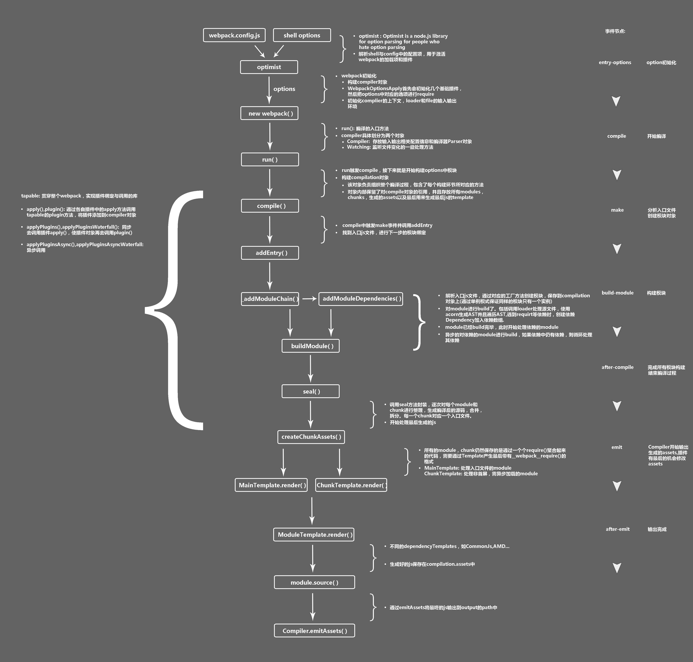

## webpack 基本概念

`webpack`有以下概念：

- `entry`：构建入口，分为单入口和多入口，入口不同`webpack`构建过程生成的依赖树也不会相同，最红也会生成不同的`chunk`
- `loader`：模块编译器，用于处理不同文件类型的模块代码，在`webpack`里每个单独的文件都可以成为一个单独的`module`，这些单独的`module`需要通过不同的`loader`解析，例如`babel-loader`解析`jsx`代码生成普通的`React.createElement`代码，`less`转换成`css`等
- `plugin`：顾名思义，拓展程序，对不同类型的模块生成的代码进一步处理的程序，例如压缩混淆`js`代码，将构建生成 的`js`、`css`代码插入`html`
- `chunk`：代码块`chunk`对应的是代码分割的概念，即`code splitting`，代码分割即将`webpack`生成的`bundle`拆分成不同的代码块去加载，该功能收益来自于 HTTP 缓存机制，对一些项目中基本不变的代码模块抽取出一个单独的`chunk`进行处理，会在代码更新的时候避免请求该`chunk`，从而提高页面加载速度，提升用户体验。
- `resolve`：`resolve`在`webpack`中负责解析模块路径，或者提供方便开发的 `alias`功能等

## 构建流程



### 获取配置项

`webpack`支持通过配置文件（`webpack.config.js`），或者`CLI`的方式向`webpack`传递配置项，且**`CLI`方式注入的配置项优先级高于配置文件中的配置项**。

### 实例化 compiler 对象

如果使用`webpack`的 nodejs 接口来编写`webpack`的启动程序，这一过程可以直观地感受到，通过 nodejs 接口会直接返回一个`compiler`对象。

```javascript
const webpack = require('webpack');

// 传入配置项作为参数，获取compiler对象
const compiler = webpack({ ...options });
```

### 构建依赖 graph

`compiler`对象内部的`run`异步方法会启动构建流程，首先从`entry`访问入口文件开始，调用`loader`编译模块代码，将模块之间的引用全部转换成`nodejs`的[`CommonJS`语法](http://nodejs.cn/api/modules.html)，然后使用`Acorn`转换成`AST`，根据`ImportDeclaration`节点类型递归解析依赖模块，重复这个过程，最后形成一个依赖树。

```javascript
const acorn = require("acorn")
const walk = require("acorn-walk")

class Compiler {
  constructor(options) {
		this.entry = options?.entry;
    this.output = options?.output;
    this.module = options?.module;
    this.modules = [];
  }

  // 执行构建流程
  run() {
    this.modules.map((_module) => {
      _module.dependencies.map((dependency) => {
        this.modules.push(this.buildModule(dependency));
      });
    });

    this.emitFiles();
  }

  buildModule(fileName = this.entry) {
    const dependencyGraph = [];
    // 使用指定的loader去编译模块代码
		const loader = this.module.rules.find(v => v.test.test(fileName));
    // 获取模块源代码
    const source = fs.readFileSync(fileName, "utf-8");
    const transformCode = require(loader.loader)(source);

    // 将编译后的js模块代码使用acorn获取ast并遍历获取依赖树
    walk.transformCode(acorn.parse(transformCode), {
      if(node.type === 'ImportDeclaration') {
				dependencyGraph.push(node.value);
      }
    })

    return {
      filename, // 文件名称
      dependencies: dependencyGraph, // 依赖列表
      transformCode, // 转化后的代码
    };
  }

  // 输出chunk
  emitFiles() {}
}
```

### 注入 require 方法

对于最终生成的所有依赖模块极其内部的代码，会通过`__webpack__require`这个方法去执行。其内部具有缓存机制，对于已经加载执行的模块代码会直接返回结果。

```javascript
function __webpack__require(moduleId) {
  // 对于已经加载的模块，直接返回结果
  if (installedModules[moduleId]) {
    return installedModules[moduleId].exports;
  }

  // 没有加载的模块在installedModules创建新的缓存记录
  const module = (installedModules[moduleId] = {
    id: moduleId,
    loaded: false,
    exports: {},
  });

  // 调用模块内部的方法，获取module.exports
  module[moduleId].call(
    module.exports,
    module,
    module.exports,
    __webpack__require,
  );

  // 标记模块加载
  module.loaded = true;
  return module.exports;
}
```

### 生成代码

最终生成的代码会使用 IIFE 来包裹，其参数就是依赖 graph，执行程序就是`__webpack__require`

```javascript
class Compiler {
  //...

  emitFiles() {
    let modules = '';
    this.modules.map(_module => {
      modules += `'${_module.filename}' : function(require, module, exports) {${_module.transformCode}},`;
    });

    const bundle = `
        (function(modules) {
          function require(fileName) {
            const fn = modules[fileName];
            const module = { exports:{}};
            fn(require, module, module.exports)
            return module.exports
          }
          require('${this.entry}');
        })({${modules}})
    `;

    fs.writeFileSync(outputPath, bundle, 'utf-8');
  }
}
```

