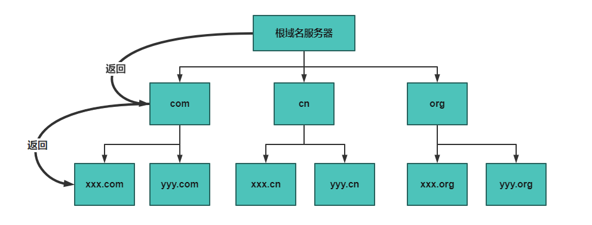
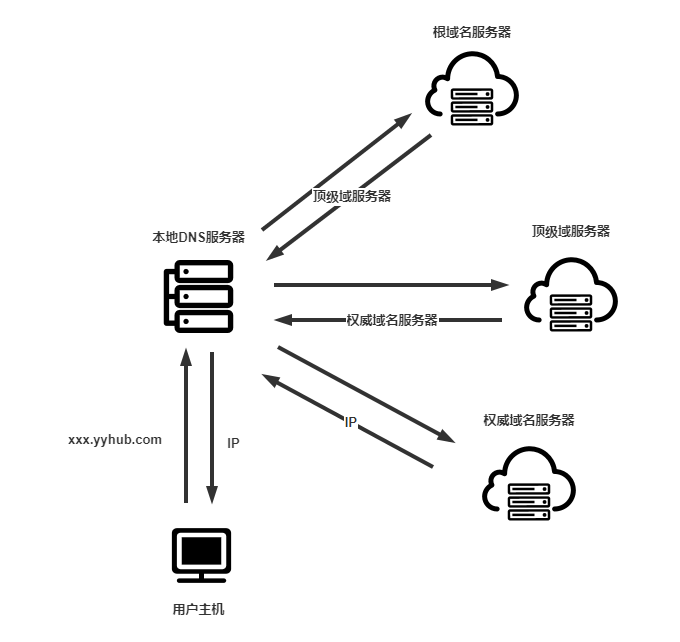

## 什么是 DNS

`DNS`，Domain Name System，域名系统，其主要任务是进行从主机名到 IP 地址的转换。`DNS`也属于应用层的协议，然后`DNS`不同于 web 应用，文件传输应用以及电子邮件应用等独立应用，`DNS`通常是作为其他网络应用程序绑定提供的一种核心功能。

`DNS`由两部分组成：

- 一个由分层的`DNS`服务器实现的分布式数据库
- 一个使得主机能够查询分布式数据库的应用层协议，用于定义`DNS`报文等内容

`DNS`建立在**运输层`UDP`协议**的基础上，运行端口为`53`，在[【RFC1035】](https://tools.ietf.org/html/rfc1035)中定义协议内容。

### DNS 提供的服务

- 根据主机名获取`IP`地址
- 根据主机别名获取主机名以及对应的`IP`地址，这里要清楚一个概念是**规范主机名**：规范主机名往往比主机别名要难记，所以一般网站会采用配置别名来处理请求，例如`www.baidu.com`和`baidu.com`可以称为别名，但是规范主机名往往比这些要长要难记忆，所以 DNS 需要从用户请求的别名获取规范主机名和`IP`地址
- 邮件服务器别名，邮件地址一般形如`xxx@yyy.com`等，但是真正的邮件服务器的主机名却不是这样，电子邮件程序可以调用`DNS`对提供的主机名进行解析，以获得其规范主机名和对应的`IP`地址
- 负载均衡，大型网站往往采用多台服务器部署的方式来均衡访问负载，每台服务器都对应一个`IP`地址，在这种情况下，_一个主机域名对应`n`个`IP`地址的集合_。当客户端发起请求时，`DNS`会循环整个`IP`地址的集合来进行分配，从而达到负载均衡的效果。

## 分布且分层的 DNS 服务

由于全世界庞大且永远在持续增长的域名数量，所以`DNS`不可能采用单一的服务器来运行服务，其使用分布式其分层次的`DNS`服务器架构。

分布式也就是`DNS`服务器遍布全球各地具有互联网的地方，分层次是指`DNS`服务器大致可分为三种类型：

- **根`DNS`服务器**：或者叫根域名服务器，负责返回顶级域的权威域名服务器地址
- **`TLD`(Top Level Domain)顶级域名服务器**：负责返回权威域名的服务器地址
- **权威`DNS`服务器**：负责返回请求域名的`IP`地址，可能包含主机别名的`IP`地址

### 本地 DNS 服务器

还有一种属于`ISP`(Internet Service Provider，电信，联通等都属于互联网服务提供商)提供的本地`DNS`服务器，为日常入网家庭提供的服务。本地`DNS`服务器通常与家庭用户的主机相隔不到几个路由器，它主要起**代理转发**的作用，将用户请求解析的主机名首先转发到根域名服务器，获取顶级域名服务器的地址；然后本地`DNS`服务器再次请求顶级域名服务器以获取权威域名服务器的地址，最后本地`DNS`服务器再次向权威域名服务器请求以获取真正的`IP`地址（考虑主机别名的情况），并把这个地址返回给用户主机。

本地`DNS`服务器也可以设置为一些*慈善机构*提供的公用 DNS，例如 Google Cloud DNS，114 等

### DNS 客户端

`DNS`客户端，也叫域名解析服务器客户端，通常是操作系统内置的客户端程序，例如在 Windows 中，具有 ipv4，ipv6 的本地`DNS`服务器配置程序，用于引导 DNS 客户端向具体的本地`DNS`服务器发送第一个 DNS 请求。

### DNS 缓存

从上文了解到，在`DNS`分层服务器之间请求获取域名的最终`IP`地址，往往需要多次请求，考虑到服务器物理路径上的距离以及网络时延，这种请求延时是一个不小的开销，所以`DNS`中还具有缓存功能。

`DNS`缓存非常的简单，在一个获取主机名对应`IP`地址的请求链中，当某个`DNS`服务器接收到一个`DNS`应答以后，会将请求的主机名和获取的`IP`地址映射保存在服务器存储空间中，通常会保存`2`天时间。这样当相同主机名的请求到达该域名服务器后，就可以直接从本地存储中获取对应的`IP`地址并响应，避免了后续的请求查询。

## DNS 服务流程

下面让我们来梳理一下`DNS`解析主机名并返回`IP`地址的主要流程：

- 用户输入`URL`
- 浏览器获取`URL`中的主机名，也就是域名
- 浏览器调用系统的`DNS`客户端向本地`DNS`服务器发送`DNS`查询报文，所有的`DNS`请求和响应报文都通过`53`端口使用 UDP 协议传输
- 本地`DNS`服务器收到请求后向根域名服务器发送请求并获取顶级域名服务器的地址
- 本地`DNS`服务器向顶级域名服务器的地址发送请求并获取权威域名服务器的地址，如果是权威域名则到这里结束，如果是主机别名则继续请求权威域名服务器，以获取主机别名对应的主机规范名和`IP`地址
- 本地`DNS`服务器向用户电脑的`DNS`客户端发送响应，其中包含浏览器请求的主机名对应的`IP`地址

- 浏览器获取`DNS`客户端提供的`IP`地址，就能够向该`IP`地址的`80`端口的`HTTP`服务器发起建立 TCP 连接的请求

## DNS 服务的资源记录

所有`DNS`服务器都存储了资源记录，其提供主机名到`IP`地址的映射，每个`DNS`响应报文都包含一条或者多条资源记录。资源记录包含以下信息：

- `TTL`，表示资源记录的缓存时间
- `Name`、`Value`以及`Type`，其中`Name`、`Value`的值取决于`Type`

1. 如果`Type = A`，则`Name`是主机名，`Value`是主机名对应的`IP`地址
2. 如果`Type = NS`（Name Server，域名服务器），则`Name`是一个域名，`Value`是知道如何获取该域名的`IP`地址的权威`DNS`服务器的主机名
3. 如果`Type = CNAME`（Canonical Name，真实名称），则`Value`是别名为`Name`的主机对应的规范主机名
4. 如果`Type = MX`，则`Value`是别名为`Name`的邮件服务器的规范主机名

这里重点需要关注的是`Type = NS`和`Type = CNAME`的情况，`Type = NS`尝尝用于`CDN`服务配置，而`Type = CNAME`则用于主机别名的配置。

以个人站点使用 Cloudflare 提供的免费 CDN 为例，需要在域名商处配置以下两个 Cloudflare 提供的 CDN 服务器的域名

`CNAME`此时需要在 Cloudflare 的 CDN 处配置解析到 GitHub Pages 的免费域名，也就对应了网站的规范主机名，也就是网站实际资源所在的服务器域名。

